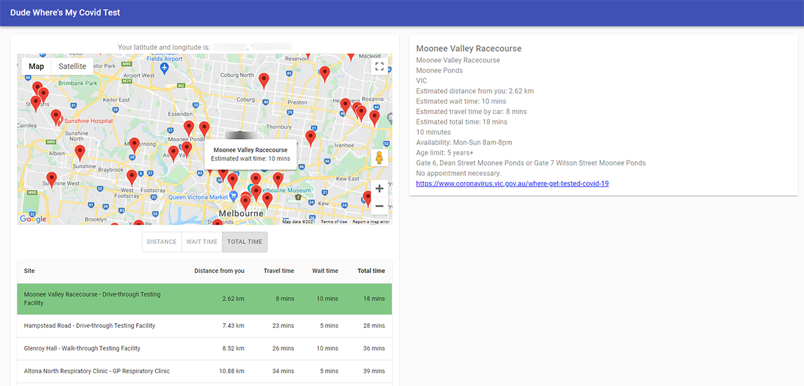

# Dude Where's My Covid Test

A simple app that aggregates data from official Victorian government sources and provides a contextual list of sites
where you can be tested for covid. The aim is to provide the user with a list of options based on wait and travel time,
allowing them to pick the quickest overall.



## Requirements

* [NodeJs 14+](https://nodejs.org/en/download/)
* [Yarn](https://classic.yarnpkg.com/en/)

## Getting started

```
git clone git@github.com:joshystuart/dudewheresmycovidtest.git
```

#### Install dependencies

```
yarn bootstrap
```

#### Build the API

```
yarn build:api
```

#### Start the API

```
yarn start:api
```

OR to automatically rebuild and reload when files change within the `packages/api` folder

```
yarn start:api:watch
```

The api will start on: http://localhost:4000

You can query it by
calling: `GET http://localhost:4000/facilities?latitude=-37.8002166363644&longitude=144.95743562213022`

#### Start the client

```
yarn start:client
```

The browser will open at: http://localhost:3000

It will automatically rebuild and reload when files change within the `packages/client` folder
