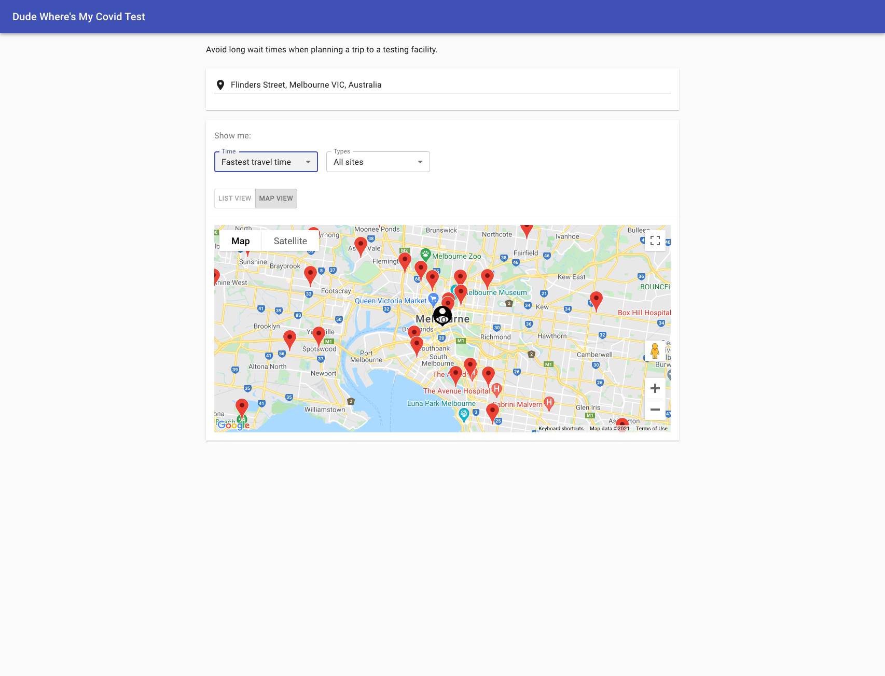
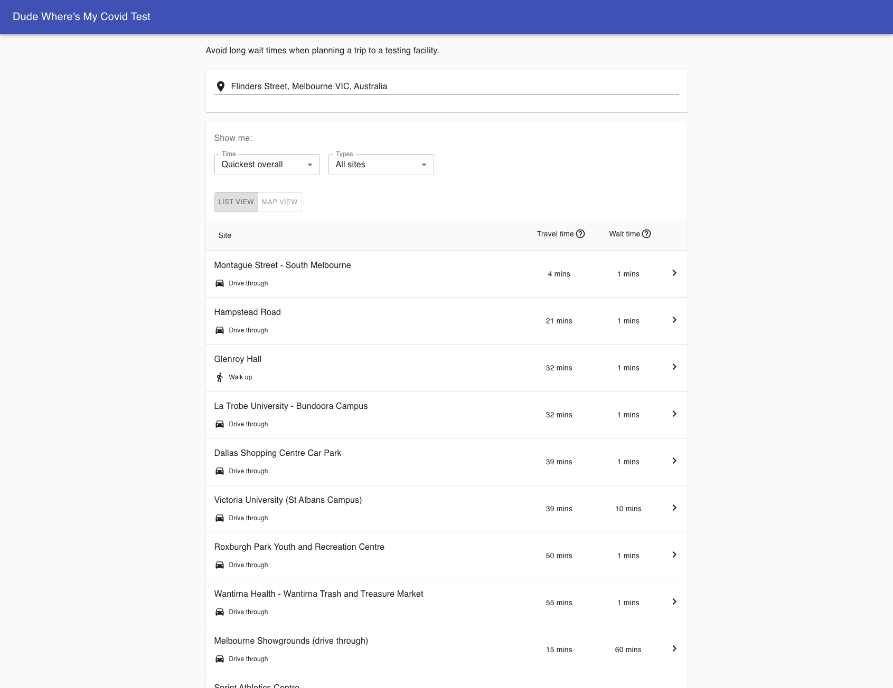

# Dude Where's My Covid Test

A simple app that aggregates data from official Victorian government sources and provides a contextual list of sites
where you can be tested for covid. The aim is to provide the user with a list of options based on wait and travel time,
allowing them to pick the quickest overall.




## Requirements

- [NodeJs 14+](https://nodejs.org/en/download/)
- [Yarn](https://classic.yarnpkg.com/en/)
- [Docker](https://docs.docker.com/get-docker/)

## Overview

There are several components that make up the DWMCT application.

- [Client app](sites/client): This is the website that users see.
- [API](sites/api): This is the public API that the client utilises to get testing facilities that are relevant to the user
- [Testing facilities schedule task](cron/testing-facilities): This periodically fetches all the testing facility data and stores it in a postgres db.
- [Testing wait time schedule task](cron/testing-wait-time): This periodically fetches all the wait time data for each testing facility and stores it in a postgres db.

## Getting started

Check out the repository:

```
git clone git@github.com:joshystuart/dudewheresmycovidtest.git
```

### Running the app

The simplest way to run the app locally is by using the docker-compose script. This will start up all the services required and run in an isolated environment.

```
docker-compose up -d client
```

This will:

- Start postgres: localhost:5432
- Start the API
- Start the client http://localhost:5001
- Start and run the testing facility cron job to pre-populate the testing facility data in postgres
- Start and run the testing wait time cron job to pre-populate the wait time data in postgres

#### API

The API will be running on: http://localhost:5000. You can hit it using a curl command to test the endpoints:

- health: `curl http://localhost:5000/health`

### Running the app for development

#### Start postgres

The API requires a postgres db to be running. You can run your own, but it's easiest to use the docker-compose postgres script

```
docker-compose up -d postgres
```

It can be accesses from your host machine by using the following credentials:

```
username: "dwmc"
password: "password"
host: "localhost"
port: "5432"
database name: "dwmc"
```

#### Install dependencies

```
yarn bootstrap
```

#### Build all the services

```
yarn build
```

#### Start the API

```
yarn start:site:api
```

OR to automatically rebuild and reload when files change within the `packages/api` folder

```
yarn start:site:api:watch
```

The api will start on: http://localhost:5000

You can query it by
calling: `GET http://localhost:5000/facilities?latitude=-37.8002166363644&longitude=144.95743562213022`

#### Start the client

```
yarn start:site:client
```

The browser will open at: http://localhost:5001

It will automatically rebuild and reload when files change within the `packages/client` folder
